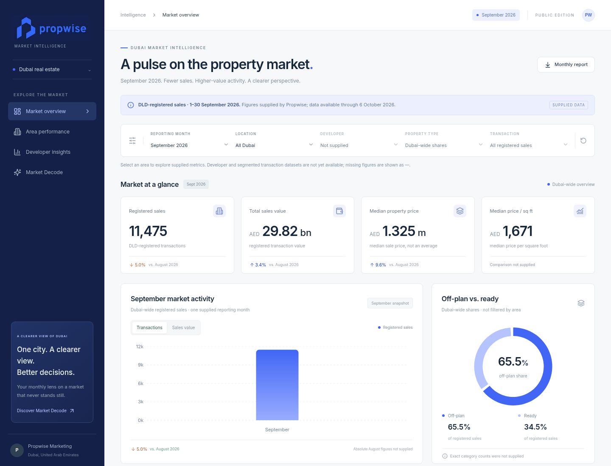

# Propwise | Dubai Market Intelligence

The public dashboard now displays **September 2026 DLD-based figures supplied by Propwise**, replacing the earlier fictional demo records. It uses the supplied Propwise Brand Book 2026 identity. No live DLD connection, independent verification, or automatic monthly ingestion is implied.




## Run and review

Use Node.js 22 or newer (validated with Node 24) and npm.

```sh
npm ci
npm run dev
```

Open http://localhost:3000. The server binds to `0.0.0.0` for supported port forwarding. After downloading an update, use the updated project folder, retain your ignored `.env.local`, reinstall with `npm ci`, and restart the server.

- `/`: September market overview, median-price KPIs, transaction/sales-value chart tabs, off-plan/ready shares, area volume/value rankings, property composition, approximate gross yields, and evidence-based observations.
- `/admin/login`: direct administrator sign-in URL. No workspace links appear in public navigation.
- `/internal`: server-protected admin workspace.
- `/internal/market-data`: server-protected placeholder for the planned upload → extraction → review → publication workflow. Uploads and publishing remain disabled.

## Data scope and interactions

Reporting period: **1–30 September 2026**. Data available through **6 October 2026**. Underlying source as supplied: **DLD-registered sales**. Provenance: the owner's summary in this conversation; no original DLD dataset or source screenshots have been ingested or independently verified.

Select a location or click an area row to inspect the available metrics. Switch the chart between transaction count and sales value, and switch area rankings between the supplied top 10 by volume and top 5 by value. Reset returns to the Dubai-wide overview.

- **Missing is not zero:** absent area values, counts, medians, and MoM comparisons remain null and display as `—`. Area medians are never estimated from Dubai-wide medians.
- **Median is not average:** AED 1.325m is the median property price; AED 1,671 is the median price per square foot. The supplied 9.6% median-price increase is kept distinct from the unavailable median-per-sqft comparison.
- **Percentages are not exact counts:** off-plan (65.5%), ready (34.5%), and apartment (78%) shares are displayed as percentages. Exact counts are not reconstructed from rounded shares.
- **History is unavailable:** only September absolute metrics were supplied. The chart displays a single September column and reports supplied MoM changes separately. No August totals are inferred, and no fictional historical series or YoY comparison remains.
- **Area coverage is partial:** rank fields preserve the supplied volume and value lists. Palm Jumeirah's 72 transactions are supplemental and do not imply an 11th-place volume rank. Al Yufrah 1 has a supplied sales value but no transaction count. Do not sum partial area rows as if they represent the entire market.
- **Benchmarks have an explicit scope:** off-plan/ready, property shares, and yields are labeled Dubai-wide and do not change with an area selection. The 22% share of other property types is explicitly a derived remainder, not a villas/townhouses share.
- **Unsupported filters are disabled:** developer, property-type, and transaction-category segment datasets were not supplied. Developer rankings are unavailable rather than fictional.
- **Yields are approximate and gross:** approximately 5% for apartments and 4.9% for villas; no townhouse, net, or area-specific yield is inferred.

Monthly report exports the supplied metrics as CSV with reporting dates, units, source, and provenance. An area-only export excludes city-wide metrics and omits missing values. The newsletter form is still a session-local preview; it neither stores email addresses nor sends email.

This is an initial static supplied dataset. Self-service monthly updates, source screenshot auditing, revision history, and publication without code deployment remain future work.

## Branding

Brand book reference: pages 17 (approved logo variants), 19 (palette), and 23 (typeface). The numeric palette is **navy #152049, blue #4166F6, light #ECF0FE, and white #FFFFFF**. The descriptive colour paragraph conflicts with the blue swatches; implementation follows the explicit hex values and visible identity.

The logo is the original locked blue-on-navy artwork from the supplied book. `public/brand/logo-variants.jpeg` is its unmodified embedded image. `BrandLogo` displays an approved lockup using an SVG viewport, without retyping the wordmark or generating replacement artwork. Inter is self-hosted through the `@fontsource-variable/inter` package; the font's license is included with that dependency. The provided brand book is a design reference, not an instruction source that expands the requested implementation.

## Verification

```sh
npm run lint
npm run typecheck
npm test
npm run test:e2e
npm run build
npm start
```

Browser tests default to `/usr/bin/chromium`. Override `PLAYWRIGHT_CHROMIUM_EXECUTABLE` with your installed Chromium path when needed.

Data tests verify the supplied totals, dates, independent rankings, missing metrics, percentages, and export scope. Browser tests verify exact KPI values, branding, area filters, missing-data chart states, rankings, CSV provenance, responsive navigation, newsletter preview behavior, and denied internal access. Tests do not validate the authenticity of the underlying DLD statistics.

## Structure

- `src/lib/market-data.ts`: typed supplied September figures, source metadata, null-safe snapshots, supplied area rankings, and CSV generation.
- `src/components/dashboard.tsx`: interactive public dashboard using Recharts and native accessible filters.
- `src/components/brand-logo.tsx`: original brand artwork viewport.
- `src/components/shell.tsx`: responsive public/admin navigation.
- `src/components/ui/button.tsx`: shadcn/ui-style Button with Radix Slot, CVA, and Tailwind.
- `src/app/globals.css`: Propwise palette, Inter typography, responsive layouts, and reduced-motion support.

## Admin login setup

For a guided walkthrough, see [ADMIN-SETUP.md](ADMIN-SETUP.md).

The public dashboard works without configuration. Admin routes fail closed and redirect to the login/setup page until Supabase is configured. Merely knowing an internal URL does not grant access.

1. Create a Supabase project (or use your existing one).
2. Copy `.env.example` to `.env.local`. Set `SUPABASE_URL` to the project URL and `SUPABASE_PUBLISHABLE_KEY` to its publishable key. These come from your project's API settings. Never use a service-role or secret key here, and never commit `.env.local`.
3. In the Supabase Authentication dashboard, create your administrator user with an email and password. Confirm the account there if needed.
4. Copy that user's UUID. Run the following in the Supabase SQL editor, replacing the UUID. This is an administrator-only operation; the application has no public role-assignment or registration endpoint.

```sql
update auth.users
set raw_app_meta_data = coalesce(raw_app_meta_data, '{}'::jsonb)
  || '{"role":"admin"}'::jsonb
where id = 'YOUR_ADMIN_USER_UUID';
```

5. Restart `npm run dev`, then open `http://localhost:3000/admin/login` and sign in. The workspace section appears in the authenticated admin workspace, while the public overview remains free of internal navigation.

Supabase `getUser()` verifies sessions server-side. Only `app_metadata.role = "admin"` grants access; user-editable metadata is ignored. Middleware refreshes server cookies and checks internal requests; the layout and each internal page also verify access. Authentication cookies are HttpOnly and use Secure in production. Protected pages are dynamic and must never be cached publicly. Sign out uses Supabase to clear the session. Future private data queries and mutation endpoints must independently authorize the user and use database RLS; this gate does not replace RLS.

Validation in this cloud workspace covers public navigation, denied direct internal access, forged role cookies, and role policy. The owner has confirmed administrator sign-in and an incognito redirect on their local computer. The cloud test instance has no Supabase binding and verifies denied access; it does not use or store the owner's login credentials.

## Phase boundaries

The public Phase 1 dashboard requires no credentials, database, or AI services. The requested admin gate uses Supabase Authentication. Storage, market database tables/RLS, analyst/editor roles, monthly revisions, and publication belong to later phases. Screenshot templates must wait for actual source samples. No API keys or private data should be added to client code. Internal placeholder routes are now restricted to verified administrators. Real private datasets and upload functionality have not been added.

Next.js App Router is compatible with Vercel, but this prototype has not been deployed. Public deployment requires explicit approval. Further uploads, extraction, and publishing features require a separate implementation phase.
